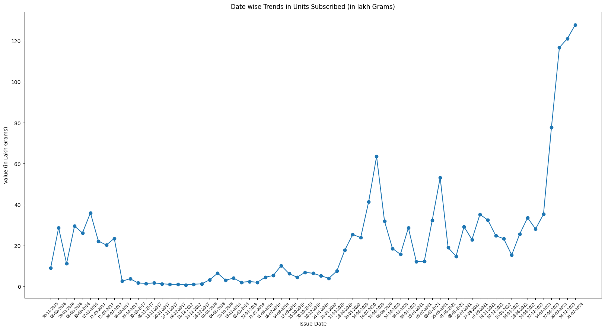
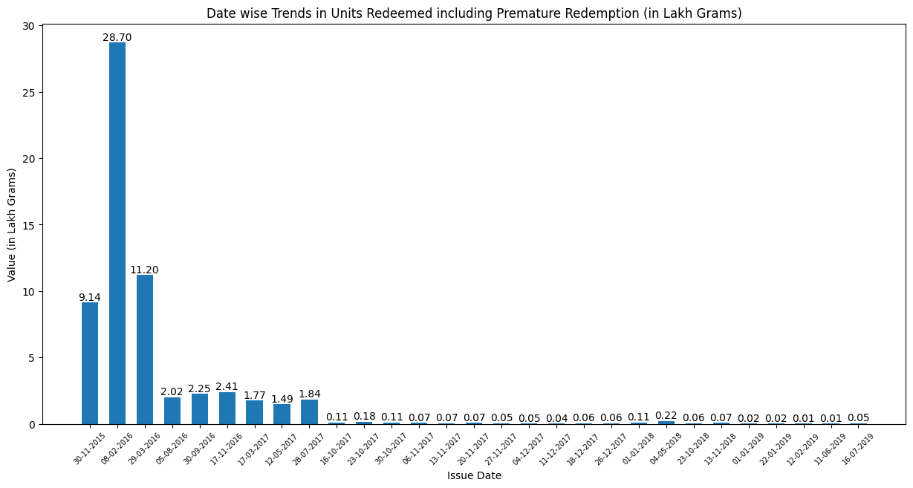

Sovereign Gold Bondss are government securities denominated in grams of gold. They are substitutes for holding physical gold. Investors have to pay the issue price in cash and the bonds will be redeemed in cash on maturity. The Bond is issued by Reserve Bank on behalf of Government of India. The trend in Sovereign Gold Bonds issued and redeemed, including premature redemption has been analysed here. 

